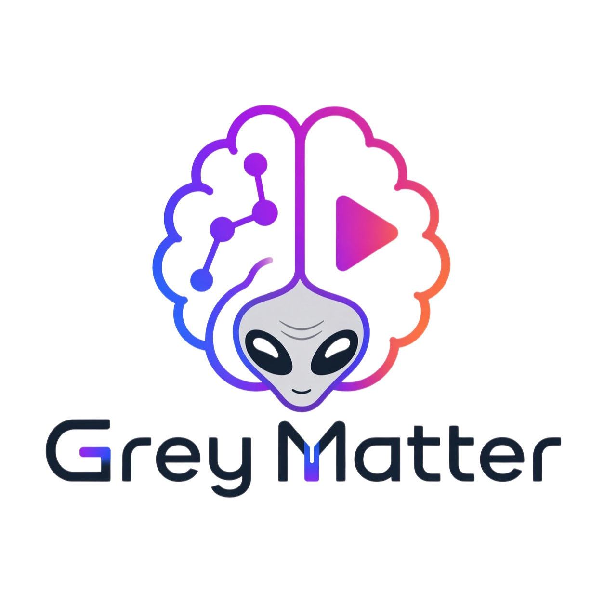

<div align="center">

<div align="center">


  <svg width="120" height="120" viewBox="0 0 120 120" fill="none" xmlns="http://www.w3.org/2000/svg">
  <defs>
    <radialGradient id="bgGrad" cx="50%" cy="50%" r="50%">
      <stop offset="0%" stop-color="#0f172a"/>
      <stop offset="100%" stop-color="#020617"/>
    </radialGradient>
    <radialGradient id="brainGlow" cx="50%" cy="50%" r="50%">
      <stop offset="0%" stop-color="#06b6d4" stop-opacity="0.3"/>
      <stop offset="100%" stop-color="#06b6d4" stop-opacity="0"/>
    </radialGradient>
    <filter id="glow">
      <feGaussianBlur stdDeviation="2" result="coloredBlur"/>
      <feMerge>
        <feMergeNode in="coloredBlur"/>
        <feMergeNode in="SourceGraphic"/>
      </feMerge>
    </filter>
  </defs>
  <!-- Background circle -->
  <circle cx="60" cy="60" r="58" fill="url(#bgGrad)" stroke="#06b6d4" stroke-width="1" stroke-opacity="0.4"/>
  <!-- Glow layer -->
  <circle cx="60" cy="60" r="40" fill="url(#brainGlow)"/>
  <!-- Brain shape - left hemisphere -->
  <path d="M60 30 C48 30 38 36 34 46 C30 54 32 62 36 68 C40 74 40 80 44 84 C48 88 54 88 58 86 L60 84" stroke="#06b6d4" stroke-width="1.5" fill="none" filter="url(#glow)" stroke-linecap="round"/>
  <!-- Brain shape - right hemisphere -->
  <path d="M60 30 C72 30 82 36 86 46 C90 54 88 62 84 68 C80 74 80 80 76 84 C72 88 66 88 62 86 L60 84" stroke="#06b6d4" stroke-width="1.5" fill="none" filter="url(#glow)" stroke-linecap="round"/>
  <!-- Center divider -->
  <line x1="60" y1="30" x2="60" y2="84" stroke="#06b6d4" stroke-width="0.8" stroke-opacity="0.5" stroke-dasharray="3 2"/>
  <!-- Neural connections - left -->
  <path d="M44 46 Q50 44 54 50" stroke="#10b981" stroke-width="1" fill="none" filter="url(#glow)" stroke-linecap="round"/>
  <path d="M38 58 Q46 56 50 62" stroke="#8b5cf6" stroke-width="1" fill="none" filter="url(#glow)" stroke-linecap="round"/>
  <path d="M40 70 Q48 68 52 74" stroke="#f59e0b" stroke-width="1" fill="none" filter="url(#glow)" stroke-linecap="round"/>
  <!-- Neural connections - right -->
  <path d="M76 46 Q70 44 66 50" stroke="#f43f5e" stroke-width="1" fill="none" filter="url(#glow)" stroke-linecap="round"/>
  <path d="M82 58 Q74 56 70 62" stroke="#3b82f6" stroke-width="1" fill="none" filter="url(#glow)" stroke-linecap="round"/>
  <path d="M80 70 Q72 68 68 74" stroke="#f97316" stroke-width="1" fill="none" filter="url(#glow)" stroke-linecap="round"/>
  <!-- Neural nodes -->
  <circle cx="44" cy="46" r="2" fill="#10b981" filter="url(#glow)"/>
  <circle cx="38" cy="58" r="2" fill="#8b5cf6" filter="url(#glow)"/>
  <circle cx="40" cy="70" r="2" fill="#f59e0b" filter="url(#glow)"/>
  <circle cx="76" cy="46" r="2" fill="#f43f5e" filter="url(#glow)"/>
  <circle cx="82" cy="58" r="2" fill="#3b82f6" filter="url(#glow)"/>
  <circle cx="80" cy="70" r="2" fill="#f97316" filter="url(#glow)"/>
  <circle cx="60" cy="30" r="2.5" fill="#06b6d4" filter="url(#glow)"/>
</svg>


## What is Grey Matter?

Gray Matter is a web application that runs your video through **Meta's TRIBE v2 brain encoder** — a simulated fMRI model that runs on GPU — and produces a second-by-second breakdown of how the human brain responds to your content.

An LLM cross-references the brain activation data with video keyframes and a word-level transcript to diagnose what's working, what's losing attention, and exactly when. You then get a streaming AI chat interface to explore the results.

---

## Features

- 🧠 **Brain Encoder** —Using Meta's TRIBE v2 model runs, producing 7-region neural activation data per second of video
- 📊 **Live Brain Timeline** — Interactive chart showing Prefrontal, STS, Visual, Auditory, Heschl's, Broca's, and Motor cortex activation, synced to video playback
- 🎬 **Synced Playback** — Video, brain chart, word-level transcript, and frame strip all stay in perfect sync
- 💬 **AI Chat** — Streaming chat powered by Kimi K2.6 (128K context) with full diagnosis as context; ask anything about your video's neural performance
- 📋 **Executive Brief** — Auto-generated hook verdict, top moments, weak spots, and retention prediction
- 🗂️ **History** — All past analyses are persisted in a proper dataset (Supabase) and accessible via shareable URL

---

## Demo

| Upload | Processing | Results |
|--------|------------|---------|
| Drag-and-drop `.mp4 / .mov / .webm` | Live SSE progress stream, animated 3D brain | Video + brain chart + transcript + AI chat |

> ⚡ Processing takes ~14–15 minutes. For demos, a pre-processed video is preloaded.

---

## Architecture

```
Browser                         Hetzner VPS (Docker)              Supabase
  │                                    │                              │
  ├── POST /api/scan                   │                              │
  │   Upload .mp4 ──────────────────►  Save to disk ──────────────►  INSERT analyses
  │   ◄── { id }                      │                              │
  │                                    │                              │
  ├── GET /api/progress/[id] (SSE)     │                              │
  │   ◄── step updates...             ├── modal run (14 min)         │
  │                                    ├── extract_features.py        │
  │                                    ├── diagnose.py ────────────►  UPDATE diagnosis
  │                                    │                  status=done │
  │                                    │                              │
  ├── GET /api/results/[id]            │                              │
  │   ◄── features + brief + meta  ◄──┼──────────────────────────── SELECT from analyses
  │                                    │                              │
  └── POST /api/chat (SSE)            │                              │
      ◄── Kimi K2.6 stream           ├── Streaming LLM chat ──────►  INSERT chat_messages
```

## Architecture



## User Flow



### Stack

| Layer | Technology |
|-------|-----------|
| Frontend | Next.js 15 (App Router) + React + TypeScript |
| UI | shadcn/ui + Tailwind CSS |
| 3D Brain | React Three Fiber + drei + postprocessing |
| Charts | Recharts |
| Brain Encoding | Modal (A10G GPU) — Meta TRIBE v2 |
| LLM | Kimi K2.6 via API (128K context, multimodal) |
| Database | Supabase (Postgres) |
| Hosting | Hetzner VPS via Docker |

---

## Getting Started

### Prerequisites

- Node.js 20+
- Python 3.11+
- Docker + Docker Compose
- [Supabase](https://supabase.com) project
- Moonshot API key (Kimi K2.6)

### Environment Variables

Create a `.env.local` file at the project root:

```env
MOONSHOT_API_KEY=your_moonshot_key
MODAL_TOKEN_ID=your_modal_token_id
MODAL_TOKEN_SECRET=your_modal_token_secret
HF_TOKEN=your_huggingface_token
NEXT_PUBLIC_SUPABASE_URL=https://your-project.supabase.co
NEXT_PUBLIC_SUPABASE_ANON_KEY=your_supabase_anon_key
SUPABASE_SERVICE_ROLE_KEY=your_supabase_service_role_key
```

### Local Development

```bash
# Install dependencies
npm install

# Set up Python environment
python3.11 -m venv .venv
source .venv/bin/activate
pip install -r requirements.txt

# Run development server
npm run dev
```

### Docker Deployment (Hetzner VPS)

```bash
# Build and start
docker-compose up --build -d

# Update from GitHub
git pull && docker-compose up --build -d
```

---

## Database Schema

**`analyses`** — one row per uploaded video

| Column | Type | Description |
|--------|------|-------------|
| `id` | `uuid` | Primary key, used in all URLs |
| `status` | `text` | `processing` · `completed` · `failed` |
| `features` | `jsonb` | Brain activation data per 2s window |
| `transcript` | `jsonb` | Word-level timestamps |
| `diagnosis` | `text` | Full LLM neural breakdown |
| `brief` | `text` | Creator-facing executive summary |

**`chat_messages`** — conversation history per analysis

| Column | Type | Description |
|--------|------|-------------|
| `analysis_id` | `uuid` | FK → analyses |
| `role` | `text` | `user` or `assistant` |
| `content` | `text` | Message body |

---

## Pipeline

Each video goes through 6 stages:

```
1. Upload           → Save to disk, create DB row
2. Brain encoding   → Modal A10G GPU (~14 min) — TRIBE v2 fMRI simulation
3. Feature extract  → .npz tensor → features.json (7 brain regions, per 2s window)
4. Frame extract    → 1 JPEG keyframe per second
5. Diagnosis        → Kimi K2.6 (brain data + frames + transcript → diagnosis.txt)
6. Brief            → Kimi K2.6 → brief.txt (executive summary)
```

**Cost per video: ~$0.16 · Processing time: ~15 min**

### Brain Regions

| Region | Signal | Color |
|--------|--------|-------|
| Prefrontal | Attention, decision-making | `#06b6d4` cyan |
| STS | Social cognition, face processing | `#10b981` emerald |
| Visual cortex | Visual processing intensity | `#3b82f6` blue |
| Auditory cortex | Sound / music processing | `#f59e0b` amber |
| Heschl's gyrus | Speech perception | `#f43f5e` rose |
| Broca's area | Language comprehension | `#8b5cf6` violet |
| Motor cortex | Action / movement response | `#f97316` orange |

---

## Project Structure

```
tribev2project/
├── pipeline/                # Core Python pipeline scripts
│   ├── modal_tribev2.py     # GPU brain encoding (Modal)
│   ├── extract_features.py  # .npz → features.json
│   ├── extract_frames.py    # MP4 → JPEGs
│   ├── diagnose.py          # LLM neural diagnosis
│   └── chat.py              # LLM executive brief
├── app/                     # Next.js App Router pages
├── components/              # React components
├── lib/                     # Shared utilities
├── calibration/             # Calibration sprint data
├── Dockerfile
├── docker-compose.yml
└── run_diagnosis.sh         # CLI master script
```

---


## Contributing

This project was built for the Palestine Techno Park 2026 hackathon.

---

## License

[MIT](LICENSE) © 2026 Zaid

---

<div align="center">

Made with 🧠 and a lot of GPU time

</div>
